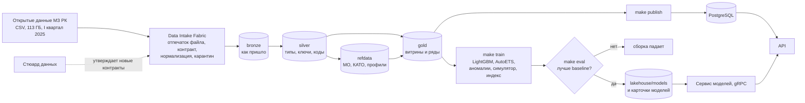
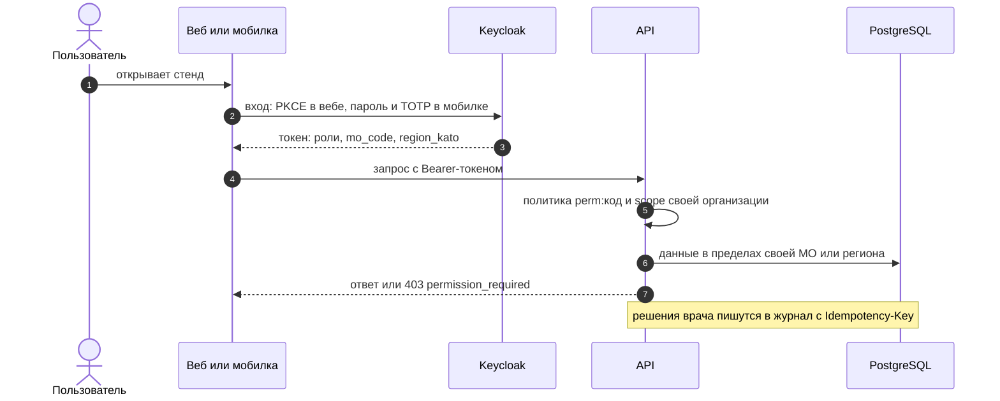
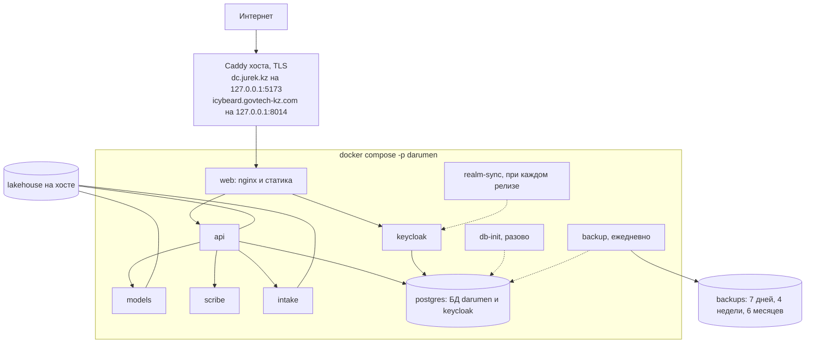
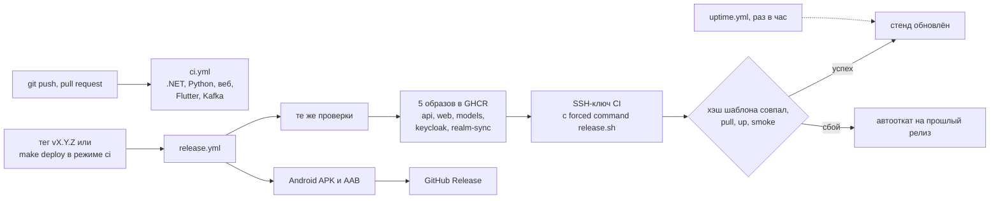

# Darumen Health

**Плановая госпитализация без неизвестности.** Экосистема для гражданина, врача ПМСП и регулятора на открытых данных МЗ РК: прогноз ожидания койки, маршрут пациента, «где быстрее», прогноз нагрузки на стационары и журнал решений врача. GovTech Camp 2026, Кейс 1.

> Основной репозиторий — [BAITC-Hacks/hack-c2f58e92-icybeard](https://github.com/BAITC-Hacks/hack-c2f58e92-icybeard). [icybeard/gov-tech-camp-case](https://github.com/icybeard/gov-tech-camp-case) — его зеркало.

## Содержание

- [Зачем](#зачем)
- [Стенды и демо-доступ](#стенды-и-демо-доступ)
- [Что умеет по ролям](#что-умеет-по-ролям)
- [Архитектура](#архитектура)
- [Технологии](#технологии)
- [Быстрый старт](#быстрый-старт)
- [Разработка](#разработка)
- [Данные и модели](#данные-и-модели)
- [Деплой и CI/CD](#деплой-и-cicd)
- [Принципы и ограничения](#принципы-и-ограничения)
- [Структура репозитория](#структура-репозитория)
- [Документация](#документация)

## Зачем

По данным коллегии МЗ РК от 19.02.2026 средний срок ожидания плановой госпитализации — 30 дней при цели 20, 222 тыс. человек (17 %) ждут дольше 20 дней, и при этом простаивает каждая шестая койка. Пациент видит статус направления, но не прогноз; врач не видит, где быстрее; регулятор видит перегрузку постфактум.

Darumen закрывает эти разрывы одним ML‑ядром на данных МЗ РК:

| Кому | Что даёт |
|---|---|
| Гражданину | «Мой путь»: стадия направления по Стандарту ҚР‑ДСМ‑27, прогноз «половина / 9 из 10 госпитализируются за N дней», чек‑лист анализов со сроками действия, где быстрее, решения врача |
| Врачу ПМСП | Рабочий список пациентов с приоритетом и флагами, маршрут пациента, ассистент направления с альтернативами, AI‑скрайб приёма с утверждением врачом |
| Регулятору и главврачу | Карта регионов с индексом доступности, прогноз нагрузки и аномалии, симулятор перераспределения, журнал решений, вопросы к данным |

## Стенды и демо-доступ

| Стенд | Адрес | Статус |
|---|---|---|
| Hetzner | https://dc.jurek.kz | Работает: веб, API, Keycloak, бэкапы; выкатка `make deploy TARGET=jurek` |
| VPS хакатона | https://icybeard.govtech-kz.com | Подготовлен, ждёт увеличения дисковой квоты (4 ГБ при потребности ~6 ГБ); выкатка — CI |

Демо-пользователи, пароль `darumen`:

| Логин | Роль | Стартовая страница |
|---|---|---|
| `citizen1` | Гражданин | Мой путь |
| `doctor1` | Врач ПМСП, МО 028B | Рабочий список |
| `doctor2` | Врач ПМСП, МО 22GN — принимающая сторона для проверки перевода | Рабочий список |
| `chief1` | Администратор организации, МО 028B | Кабинет организации |
| `regulator1` | Регулятор | Карта регионов |
| `steward1` | Оператор данных | Консоль оператора данных |
| `auditor1` | Аудитор | Журнал аудита |
| `admin1` | Администратор платформы | Пользователи и роли |

## Что умеет по ролям

| Роль | Веб | Мобильное приложение |
|---|---|---|
| Гражданин | Мой путь, сколько ждут, лекарства | Главная с карточкой «Моя госпитализация», Мой путь, сколько ждут, лекарства, вакцинация, уведомления, профиль |
| Врач ПМСП | Рабочий список, маршрут пациента с перенаправлением, ассистент направления, скрайб, журнал решений | Пациенты, маршрут, направление, скрайб, профиль |
| Главврач (org_admin) | Кабинет организации, направления, пользователи и врачи своей МО | — |
| Регулятор | Карта, регион, организация, симулятор, качество моделей, вопросы к данным | — |
| Стюард данных | Консоль загрузки данных, контракты наборов, карантин | — |
| Аудитор и админ | Журнал аудита, пользователи, роли и разрешения | — |

Права — 14 разрешений матрицы и scope «своя организация» по клейму `mo_code`, проверяются и в API, и в клиентах: [docs/rbac.md](docs/rbac.md). Интерфейсы на русском и казахском, светлая и тёмная тема.

## Архитектура

Ниже — то, что работает на стенде. Целевая архитектура национального масштаба (слои L1–L9, Iceberg, Kubernetes) — в [docs/architecture.md](docs/architecture.md).

### Компоненты


На стенде события идут через outbox в Postgres. Локальный стек (`make serve`) добавляет Kafka и Schema Registry (события Wolverine), ClickHouse и Cube (ряды для графиков), MinIO, MLflow, Valkey и Mailpit.

### Данные и модели



### Вход и права



### Развёртывание на сервере



Секреты — только в `.env` на сервере (chmod 600). Наружу публикуется один порт веба на `127.0.0.1`, TLS держит Caddy хоста.

### CI/CD



Ключ CI может только выбрать тег образов, откатить релиз или показать статус; compose и скрипты релиза на сервер ставит человек (`make vm-install-release`). Подробно — [docs/deploy.md](docs/deploy.md).

## Технологии

| Слой | Что используем |
|---|---|
| Бэкенд | .NET 10, ASP.NET Core minimal API, модульный монолит, EF Core, Dapper, Wolverine (outbox, Kafka), YARP, Scalar |
| ML и данные | Python 3.12, DuckDB, PyArrow, pandas, LightGBM, statsforecast (AutoETS), SHAP, gRPC, Dagster, MLflow |
| AI | DeepSeek на стенде, Ollama (qwen3.8) локально, faster-whisper для скрайба; каждый ответ помечен «AI‑черновик» |
| Хранилища | PostgreSQL 17 с PostGIS, Parquet-lakehouse; в dev — ClickHouse с Cube, MinIO, Valkey |
| Вход | Keycloak 26: PKCE для веба, пароль и TOTP для мобилки, 7 ролей, 14 разрешений |
| Веб | Vue 3, Vite, PrimeVue 4, Pinia, MapLibre, ECharts, vue-i18n (RU/KK) |
| Мобилка | Flutter 3.41, go_router, flutter_secure_storage |
| Инфраструктура | Docker Compose, Caddy, GitHub Actions, GHCR |

## Быстрый старт

Весь стек поднимается контейнерами; на хосте остаётся только Ollama (Docker Desktop на macOS не даёт контейнерам GPU).

```bash
cp .env.example .env                            # значения по умолчанию подходят для ноутбука
ollama pull qwen3.8:27b && make ollama-model    # локальная модель с контекстом 16k, один раз
make serve                                      # инфраструктура: Postgres, ClickHouse, Cube, Kafka, Keycloak, Mailpit, MLflow…
make pipeline                                   # данные: intake → refdata → gold → train → publish
make up                                         # API :8000, модели :50051, скрайб :8010, веб :3000
```

Веб — http://localhost:3000 (вход через Keycloak, пользователи выше). Письма Keycloak в dev ловит Mailpit — http://localhost:8025. Документация API — http://localhost:8000/scalar. Логи — `make logs`, остановка — `make down`.

**Windows** (нет `make`, Python из `ml/.venv/bin`): те же шаги прямыми командами `docker compose --env-file .env -f infra/docker-compose.yml …` — пошагово, с переустановкой с нуля, малым набором данных (`--max-parts 1`, сотни МБ вместо ~113 ГБ), тестовыми маршрутами (`scripts/dev/seed_routes.py`) и сценариями проверки — в [docs/test-scenarios.md](docs/test-scenarios.md). Тесты на Windows — `test.cmd` (всё в контейнере SDK).

## Разработка

| Команда | Что делает |
|---|---|
| `make venv` | Python-окружение для `ml/` |
| `make serve` | только инфраструктура в Docker |
| `make build` | сборка .NET и веба |
| `make test` | тесты .NET, Python и веба |
| `make lint` | ruff и `dotnet format --verify-no-changes` |
| `make models-serve` | gRPC-сервисы моделей на :50051 |
| `make scribe-serve` | AI-скрайб на :8010 |
| `make dagster` | линия активов silver → refdata → gold → models → published |

- **API:** `dotnet run --project src/Darumen.Api`, документация на `/scalar`, здоровье на `/health`. Миграции применяются при старте. Без Postgres или сервиса моделей API отвечает problem+json 503, а не падает. Контракт — [docs/api.md](docs/api.md).
- **Веб:** `cd apps/web && npm run dev` на :5173 с прокси `/api` на :8000. `npm run walk` проходит все экраны в браузере и сохраняет скриншоты.
- **Мобилка:** `cd apps/mobile && flutter run --dart-define=API_BASE=http://10.0.2.2:8000 --dart-define=KEYCLOAK_URL=http://10.0.2.2:8080`; проверки — `flutter analyze && flutter test`. Подробности — [apps/mobile/README.md](apps/mobile/README.md).
- **Apple Silicon:** сборке .NET нужны нативные `protoc` и `grpc_csharp_plugin` (`brew install protobuf grpc`). `make build` и `make test` подставляют их сами; при прямом вызове `dotnet` экспортируйте `PROTOBUF_PROTOC=/opt/homebrew/bin/protoc GRPC_PROTOC_PLUGIN=/opt/homebrew/bin/grpc_csharp_plugin`.
- **События:** Wolverine с durable outbox в Postgres и транспортом Kafka; сообщения из `proto/darumen/v1/events.proto` в формате Confluent Schema Registry. Сквозной тест — `DARUMEN_KAFKA_TEST=1 dotnet test --filter KafkaIntegrationTests` при запущенном `make serve`.

## Данные и модели

Источник — портал открытых данных [ashyq.data.gov.kz](https://ashyq.data.gov.kz), публикация МЗ РК от 6 сентября 2026. В репозиторий данные не входят (около 113 ГБ CSV), они лежат локально в `DataSets/<набор>/`.

```bash
python3 scripts/download_datasets.py --list                                        # наборы и их идентификаторы
python3 scripts/download_datasets.py referrals waiting refusals treated_count --workers 4
make data            # проверить скачанное и загрузить всю папку DataSets через Data Intake Fabric
make train           # модели ожидания и отказа, прогнозы, аномалии, симулятор, индекс доступности
make eval            # оценка против baseline на отложенных выборках; падает, если модель хуже
make publish         # витрины gold и refdata в Postgres и ClickHouse, идемпотентно
```

**Ключевые факты по данным**
- Направления, ожидающие и отказы приёмного покоя есть только за I квартал 2025 по 20 регионам; многолетняя динамика — в «Списке пролеченных случаев» (2011–2026).
- «Ожидающие» — та же когорта, что и направления, а не снимок живой очереди: составной ключ соединяется на 99,5 %.
- Ожидание считается по календарным дням; дневной стационар (профиль `DH`) — 48 % направлений с нулевым ожиданием, его выделяем отдельно.
- Персональных идентификаторов пациентов в открытых данных нет, поэтому маршрут пациента синтетический, но построен на реальных очередях.

**Качество моделей** (карточки — [docs/model-cards/](docs/model-cards/), генерируются `make train`)

| Модель | Проверка | Модель / baseline |
|---|---|---|
| Ожидание госпитализации, LightGBM-квантили | март 2025, 107 тыс. направлений | пинбол p50: 3,87 / 4,67; покрытие p90: 0,90 |
| То же, перенос на новые организации | 10 % МО, 34 тыс. направлений | пинбол p50: 3,74 / 4,83 |
| Риск отказа | март 2025 | AUC 0,791 / 0,743 |
| Прогноз госпитализаций по региону и профилю, AutoETS | 1 627 рядов, горизонт 3 месяца | MASE 0,776 / 1,049 наива; лучше наива в 74 % рядов |

## Деплой и CI/CD

| Путь | Когда | Как |
|---|---|---|
| CI | каждый push и pull request | `ci.yml`: .NET, Python, веб (lint, build, тесты), Flutter, интеграция с Kafka |
| Релиз по тегу | `git tag v1.2.0 && git push origin v1.2.0` | `release.yml`: проверки, образы в GHCR, выкатка через `release.sh`, smoke, автооткат, Android, GitHub Release |
| Ручной деплой | `make deploy` (VPS хакатона, образы собирает CI) или `make deploy TARGET=jurek` (сборка на Hetzner) | `scripts/deploy.sh`, цели — `infra/deploy/targets/*.env` |
| Данные | `make deploy-data` | витрины lakehouse на сервер и публикация в Postgres |
| Эксплуатация | `make release-status`, `make rollback`, `make backup-now`, `make restore DB=…` | статус, откат, бэкап и восстановление |

Секреты стендов — в git-ignored `infra/deploy/.env.*`, секреты Actions (`DEPLOY_*`, `ANDROID_*`) задаёт админ организации. Всё про стенды, ключи, бэкапы и квоты — [docs/deploy.md](docs/deploy.md).

## Принципы и ограничения

- **Без диагнозов и медицинских советов** (ТЗ §11): только логистика госпитализации — сроки, стадии, чек-лист по датам.
- **Человек принимает решение** (ТЗ §10.1): модель подсказывает, врач решает, каждое решение пишется в журнал.
- **Персональные данные** (ТЗ §10.2): ИИН показывается маской и в журналы не пишется; в учётной записи Keycloak и в клейме токена он лежит открытым — для внедрения нужен хэш в токене и eGov-вход (см. [test-scenarios §5](docs/test-scenarios.md)).
- **Честные статусы внешних сервисов:** почта (SMTP), push и SMS пока не подключены, адрес eGov mobile (Smart Bridge) не предоставлен — интерфейсы показывают это по `GET /api/v1/public/service-status`.
- **Каждое число с меткой происхождения:** ML‑модель, формула или AI‑черновик.

## Структура репозитория

```
src/            .NET 10: Darumen.Api, Darumen.Shared, Darumen.Contracts, Darumen.Modules/*, Darumen.Migrations
tests/          Darumen.Tests (xUnit)
ml/             Python: intake, lakehouse, признаки, модели, сервисы моделей и скрайба, тесты
apps/web/       веб: Vue 3 + Vite + PrimeVue
apps/mobile/    мобильное приложение: Flutter
proto/          контракты gRPC и событий Kafka
contracts/      контракты наборов данных (YAML)
streams/        декларации потоков для прогнозов (YAML)
refdata/        справочники (Стандарт госпитализации, внешние ориентиры)
design/         токены дизайн-системы
infra/          docker compose, Dockerfile, Keycloak (realm и темы), деплой, Postgres
scripts/        загрузка и профилирование данных, ручной деплой
docs/           документация
DataSets/       локальные данные (в .gitignore)
```

## Документация

| Тема | Документы |
|---|---|
| Продукт | [product-strategy](docs/product-strategy.md), [team-brief](docs/team-brief.md), [system-structure](docs/system-structure.md), [mobile-and-doctor](docs/mobile-and-doctor.md), [doctor-consult](docs/doctor-consult.md), [criteria-map](docs/criteria-map.md) |
| Данные | [data-catalog](docs/data-catalog.md), [data-intake](docs/data-intake.md), [gold-schemas](docs/gold-schemas.md), [data-requests](docs/data-requests.md), [access-index](docs/access-index.md), [model-cards](docs/model-cards/) |
| Архитектура | [architecture](docs/architecture.md), [tech-stack](docs/tech-stack.md), [api](docs/api.md), [rbac](docs/rbac.md), [egov-auth](docs/egov-auth.md) |
| Дизайн | [design-system](docs/design-system.md), [screen-design](docs/screen-design.md), [design-references](docs/design-references.md) |
| Демо и защита | [demo-pages](docs/demo-pages.md), [demo-script](docs/demo-script.md), [presentation](docs/presentation.md), [pre-defense-checklist](docs/pre-defense-checklist.md), [test-scenarios](docs/test-scenarios.md) — переустановка, тестовые данные, сценарии врача и гражданина, итоги ревью |
| Эксплуатация | [deploy](docs/deploy.md) |
| Исходные | [tz](docs/tz.md) — техническое задание организаторов |
