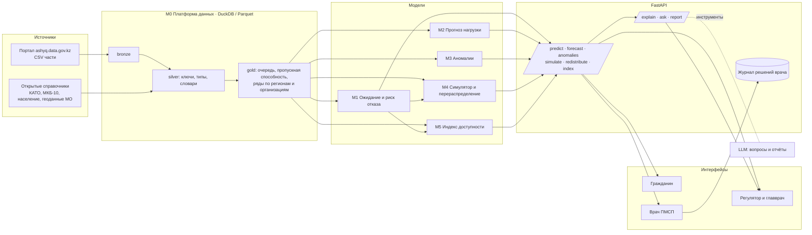

# Saulyq: функциональная структура и архитектура

Документ фиксирует, что продукт делает для каждой роли, из каких модулей состоит, как модули связаны и на чём это построено. Цифры и факты по данным см. в [data-catalog.md](data-catalog.md), контекст и решения по моделям в [team-brief.md](team-brief.md), список недостающих данных в [data-requests.md](data-requests.md).

## 1. Роли и сценарии

| Роль | Вопрос, на который отвечает продукт | Что видит | Что решает человек |
|---|---|---|---|
| Гражданин | Сколько я прожду плановую госпитализацию и где ждать меньше? | Прогноз по региону, профилю и цели направления; альтернативные организации; индекс доступности региона | Обсуждает выбор с врачом. Персональные данные не вводит |
| Врач ПМСП | Куда направить пациента, чтобы он не ждал лишнего и не получил отказ? | Ассистент направления: медиана и 90‑й перцентиль ожидания, вероятность госпитализации за 30 дней, риск отказа, альтернативы с объяснением | Подтверждает или переопределяет рекомендацию; каждое решение пишется в журнал |
| Регулятор (УЗ области, МЗ) | Где перегрузка, что будет через 1–3 месяца, что сделать? | Карта 20 регионов по всем потокам, лента аномалий, прогнозы, симулятор что‑если, индекс доступности, отчёты | Принимает решения по койкам, ставкам, перераспределению потоков |
| Главврач | Что происходит в моей организации? | Своя очередь, отказы, прогноз нагрузки приёмного покоя, сравнение с похожими организациями | Управляет расписанием и приёмом |

Сквозной сценарий демо: врач выписывает направление, видит 35 дней ожидания и альтернативу в 9 дней, подтверждает перенаправление; у регулятора загорается аномалия по перегруженной организации; в симуляторе он проверяет, сколько ставок или коек снимает проблему; гражданин на своём экране видит те же цифры.

## 2. Функциональная карта

Одно ядро, несколько потоков данных, три интерфейса. Модули ядра ниже, потоки в разделе 3.

| Модуль | Вход | Выход | Метрика качества | Этап |
|---|---|---|---|---|
| **M0 Платформа данных** | CSV с портала, справочники | Parquet‑таблицы bronze/silver/gold, витрины признаков, манифест данных с контрольными суммами | Полнота и воспроизводимость (тест сверки с манифестом) | MVP |
| **M1 Ожидание и риск отказа** | Регион, организация, профиль, диагноз (МКБ‑10), цель направления, тип территории, источник финансирования, очередь и пропускная способность организации на дату | p50 и p90 ожидания, вероятность госпитализации за 30 дней, вероятность отказа, объяснение | Пинбол‑лосс p50/p90, калибровка P(≤30 дней), AUC отказа; baseline: медиана по организации и профилю | MVP |
| **M2 Прогноз нагрузки** | Ряды: направления и госпитализации по региону × профилю (месяц), обращения в приёмный покой по организации (день), выписки по региону × профилю с 2012 года | Прогноз на 1–3 месяца с интервалами, бэктест | sMAPE и MASE по горизонтам против сезонного наива | MVP (дневной), v2 (месячный на списке пролеченных) |
| **M3 Аномалии** | Те же ряды, группы похожих организаций | Всплески, устойчивые отклонения, лента уведомлений | precision@k на размеченных всплесках, доля ложных срабатываний | MVP |
| **M4 Симулятор и перераспределение** | Входящий поток, пропускная способность, очередь, мощность (койки, ставки), сценарий | Ожидание при сценарии, перераспределение направлений между организациями региона, эффект в днях | Контрфактический эффект на I квартале 2025, согласованность с M1 | MVP (сценарии), v2 (оптимизатор) |
| **M5 Индекс доступности** | Выходы M1 по региону и профилю | Ежемесячный индекс по регионам и профилям, методика | Стабильность и интерпретируемость | v2 |
| **M6 Объяснение, вопросы, отчёты** | Выходы всех модулей | SHAP словами, ответы на вопросы на естественном языке цифрой и графиком, PDF и Excel | Точность ответов на эталонных вопросах | MVP (объяснения), v2 (вопросы, отчёты) |

Правило: модуль или поток попадает в демо только с метрикой на отложенной выборке.

## 3. Потоки данных

| Поток | Наборы | Модули | Роли |
|---|---|---|---|
| Плановая госпитализация | Направления, ожидающие (ИС БГ) | M1, M2, M3, M4, M5 | Все |
| Приёмные покои | Отказы приёмного покоя (ИС БГ) | M2, M3 | Главврач, регулятор |
| Стационары | Список пролеченных случаев (ЭРСБ), пролеченные по МО, ставки, медтехника | M2, M4 | Регулятор |
| Диагностика и лаборатории | Направления на КДУ (выборка) | M2, M3 | Регулятор |
| Вакцинация | Факты и отказы | M2, M3 | Регулятор |
| Онкология | ЭРОБ (три набора) | M2, M3, M5 | Регулятор |

Новый поток подключается описанием: источник, ключи (регион КАТО, код МО, профиль), гранулярность ряда, группа сравнения для аномалий. Код ядра не меняется.

## 4. Архитектура

### Слои

1. **Данные.** Исходные CSV лежат вне репозитория (`DataSets/`). Загрузчик проверяет каждую часть по контрольным суммам. Ingestion собирает Parquet‑слои: bronze (как есть), silver (типы, ключи, словари, календарные дни), gold (витрины: очередь по организации и профилю на каждый день, пропускная способность за 4 недели, доля отказов, ряды для прогноза). Движок: DuckDB, всё локально и воспроизводимо одной командой.
2. **Модели.** Обучающие пайплайны по модулям M1–M5, у каждой модели карточка: данные, период, признаки, метрики на отложенной выборке, ограничения. Артефакты версионируются вместе с метриками.
3. **Сервис.** FastAPI: `/predict/wait`, `/predict/refusal`, `/forecast`, `/anomalies`, `/simulate`, `/redistribute`, `/index`, `/explain`, `/ask`, `/report`. Схемы Pydantic, ответы с объяснением и версией модели. Журнал решений врача (human‑in‑the‑loop) в отдельной таблице.
4. **Интерфейсы.** Веб‑приложение с тремя ролями: гражданин, врач, регулятор. Карта регионов, графики, симулятор, лента аномалий.
5. **Языковой слой.** Ответы на вопросы и отчёты строятся LLM поверх наших API и gold‑таблиц через вызов инструментов, а не поверх сырых данных. LLM не является моделью прогноза, это интерфейс к моделям.
6. **Инфраструктура.** Docker Compose (api, web, данные), Makefile (`data`, `train`, `eval`, `serve`), GitHub Actions на тесты и линтеры.

### Схема



### Технологии

| Компонент | Выбор | Почему |
|---|---|---|
| Хранение и SQL | DuckDB + Parquet | 60 ГБ CSV обрабатываются на ноутбуке, нет сервера БД, воспроизводимо |
| Табличные модели | LightGBM (квантильная и бинарная цели) | Быстро, сильно на табличных данных, есть SHAP |
| Прогноз рядов | statsforecast (сезонные модели) + глобальная LightGBM по лагам | Тысячи коротких рядов, честный бэктест |
| Аномалии | Робастные z‑оценки по группам похожих организаций, STL по дневным рядам | Объяснимо, без обучения на разметке |
| Симулятор | Модель очереди на входящем потоке и пропускной способности; перераспределение как задача назначения (OR‑Tools) | Связан с M1 через признаки загрузки |
| Объяснимость | SHAP, шаблоны текста | Требование §7.5 ТЗ |
| API | FastAPI + Pydantic | Схемы, документация из коробки |
| Веб | Next.js, MapLibre, ECharts | Карта регионов и графики без лицензий |
| Языковой слой | Claude API с вызовом инструментов, локальная модель как запасной вариант | Ответы строго через наши API |
| Запуск | Docker Compose, Makefile, GitHub Actions | Требование воспроизводимости §7.7 ТЗ |

### Нефункциональные требования

- **Воспроизводимость.** `make data && make train && make eval && make serve` поднимает всё с нуля; манифест данных фиксирует размеры и контрольные суммы частей; фиксированные seed.
- **Приватность.** В продукт не попадают персональные данные; публичные экраны показывают только агрегаты с порогом малых чисел; онкологический реестр используется только агрегированно.
- **Human‑in‑the‑loop.** Врач подтверждает каждое перенаправление, регулятор видит рекомендацию и её основания; журнал решений хранится и выгружается.
- **Объяснимость.** Каждый прогноз возвращает вклад факторов словами; у каждой модели есть карточка с метриками и ограничениями.
- **Скорость.** Предсказания и витрины считаются заранее, API отвечает из gold‑таблиц; цель p95 < 300 мс на прогноз.

## 5. Структура репозитория (предложение)

```
saulyq/
  data/        ingestion: CSV → Parquet, справочники, манифест с контрольными суммами
  features/    очередь по организации и профилю на дату, пропускная способность, доля отказов, календарь
  models/      wait, refusal, forecast, anomaly, simulator, index; карточки моделей
  explain/     SHAP → текст
  api/         FastAPI, роутеры по модулям, журнал решений
  llm/         вопросы на естественном языке и отчёты через инструменты
web/           Next.js: гражданин, врач, регулятор
notebooks/     разведка и эксперименты
scripts/       загрузка и профилирование данных
docs/          документы
tests/         тесты данных, моделей, API
Makefile  docker-compose.yml  pyproject.toml
```

## 6. Этапы

1. **MVP.** M0, M1, дневной M2 по приёмным покоям, M3, сценарии M4, объяснения M6; интерфейсы врача и регулятора; поток госпитализации и приёмных покоев конец‑в‑конец.
2. **v2.** Месячный M2 на списке пролеченных, оптимизатор перераспределения, M5, вопросы и отчёты, экран гражданина, остальные потоки по одному.
3. **Защита.** Демо‑сценарий, карточки моделей, README, презентация с метриками и ограничениями.
