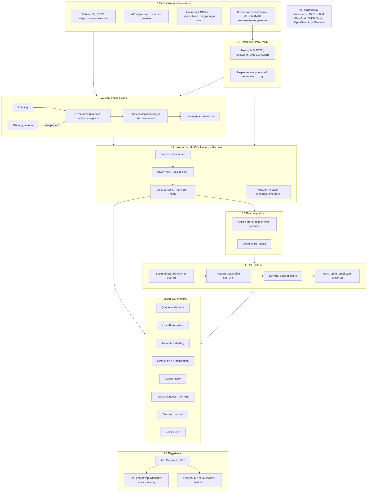

# Целевая архитектура платформы

Документ описывает платформу в том виде, в котором она может работать в масштабе страны, и путь к ней от прототипа кэмпа. Принцип: **на каждом этапе одна и та же форма, меняются только движки и число реплик**. Прототип не переписывается, он дорастает.

Связанные документы: [data-intake.md](data-intake.md) (слепая загрузка данных), [data-catalog.md](data-catalog.md) (наборы), [data-requests.md](data-requests.md) (запрос данных), [team-brief.md](team-brief.md) (контекст и решения по моделям).

## 1. Принципы

1. **Метаданные вместо кода.** Набор данных описывается контрактом, поток описывается декларацией. Новый источник подключается файлом YAML, а не новым модулем.
2. **Открытые форматы, заменяемые движки.** Данные лежат в Parquet и Iceberg на S3‑совместимом хранилище. DuckDB на ноутбуке, Trino и Spark в кластере читают одни и те же таблицы.
3. **Доменные сервисы с явными API.** Без состояния, масштабируются горизонтально, общаются через события там, где не нужен синхронный ответ.
4. **Всё версионируется.** Снимки данных (Iceberg), признаки, модели (реестр с карточками), решения людей (журнал).
5. **Приватность и безопасность по умолчанию.** Обезличивание на входе, доступ по ролям и регионам, аудит каждого действия, порог малых чисел на публичных агрегатах.
6. **Готовность к on‑prem.** Всё разворачивается в Kubernetes в государственном облаке или ЦОД НИТ без внешних зависимостей.

## 2. Роли и сценарии

| Роль | Вопрос | Поверхность | Решение человека |
|---|---|---|---|
| Гражданин | Сколько я прожду плановую госпитализацию и где ждать меньше? | eGov mobile (мини‑приложение), веб, бот | Обсуждает выбор с врачом, персональные данные не вводит |
| Врач ПМСП | Куда направить, чтобы пациент не ждал лишнего и не получил отказ? | Ассистент направления в веб‑кабинете, в перспективе встраивание в МИС | Подтверждает или переопределяет рекомендацию, решение попадает в журнал |
| Главврач | Что происходит в моей организации и что будет через месяц? | Кабинет организации | Управляет приёмом и расписанием |
| Регулятор (УЗ области, МЗ) | Где перегрузка, что будет через 1–3 месяца, какой рычаг сработает? | Ситуационный центр: карта, аномалии, прогнозы, симулятор, индекс, отчёты | Решения по койкам, ставкам, перераспределению потоков |
| Стюард данных | Что за файл пришёл, к какому контракту относится, что в карантине? | Консоль загрузки данных | Утверждает контракты и сопоставления, разбирает карантин |
| Администратор платформы | Кто имеет доступ, что с качеством моделей и данных? | Админ‑консоль, наблюдаемость | Роли, переобучение, инциденты |

## 3. Функциональные домены

Каждый домен это сервис со своим API, своими таблицами gold и своими метриками. Метрика обязательна: домен без метрики на отложенной выборке в продукт не попадает.

| Домен | Что делает | Метрика |
|---|---|---|
| **Data Intake** | Принимает любые файлы и API‑выгрузки, подбирает контракт, парсит, валидирует, кладёт в lakehouse, ведёт манифест и lineage | Доля автоматически распознанных файлов, время от появления файла до gold |
| **Reference Data (MDM)** | Реестр МО с кодами и координатами, КАТО, профили коек, МКБ‑10, услуги; разрешение сущностей «название → код» с историей изменений | Доля записей, сопоставленных без участия человека |
| **Queue Intelligence** | Ожидание госпитализации (p50, p90, вероятность за 30 дней), риск отказа, альтернативные организации, объяснение | Пинбол‑лосс, калибровка, AUC против baseline «медиана по организации и профилю» |
| **Load Forecasting** | Прогноз нагрузки на 1–3 месяца по любому зарегистрированному потоку: регионы, организации, профили, лаборатории, вакцинация | sMAPE и MASE против сезонного наива по горизонтам |
| **Anomaly & Alerting** | Всплески и устойчивые отклонения относительно похожих организаций, правила уведомлений, дедупликация сигналов | precision@k, доля ложных срабатываний |
| **Simulation & Optimization** | Модель очереди на потоке и мощности, сценарии по койкам и ставкам, перераспределение направлений как задача назначения | Контрфактический эффект на истории, согласованность с Queue Intelligence |
| **Access Index** | Ежемесячный индекс доступности плановой помощи по регионам и профилям, методика и публикация | Стабильность, воспроизводимость |
| **Insight** | Вопросы на естественном языке и отчёты через вызов инструментов доменных сервисов, PDF и Excel | Точность на эталонном наборе вопросов |
| **Decision Journal** | Журнал решений врача и регулятора: что рекомендовала система, что выбрал человек, почему | Полнота журнала, выгрузка для аудита |
| **Notifications** | Доставка сигналов в веб, почту, мессенджеры, eGov push | Доставляемость, задержка |
| **Medicines Intelligence** | Покрытие препарата по перечню АЛО, срок обеспечения рецепта (p50, p90, вероятность за 14 дней), аптеки региона с фактическим обеспечением, дефицит по региону и МНН | Пинбол‑лосс и калибровка срока обеспечения, AUC необеспечения, precision@k дефицита |
| **Consultation Scribe** | Распознавание речи на казахском и русском, черновик записи приёма только из расшифровки, памятка пациенту; всё утверждает врач; аудио удаляется после расшифровки | WER на тестовом наборе, faithfulness записи, доля принятых без правок |

## 3.1. Линейки продукта

Внешние линейки продукта и их соответствие доменам ядра. Линейка это упаковка для роли, домен это сервис; один домен обслуживает несколько линеек.

| Линейка | Для кого | Что делает | Домены ядра | Данные |
|---|---|---|---|---|
| **Darumen Health** | Все | Платформа и бренд: единый вход, роли, каталог данных, ML‑ядро | Все | Все потоки |
| **Darumen Gov** | Регулятор, главврач | Ситуационный центр: карта регионов, аномалии, прогноз на 1–3 месяца, симулятор что‑если по койкам и ставкам, индекс доступности, отчёты. Это и есть Кейс 1, за который ставят оценку | Load Forecasting, Anomaly & Alerting, Simulation & Optimization, Access Index, Insight | Все потоки |
| **Darumen Care** | Гражданин, врач ПМСП | Врачи и клиники: сколько ждать госпитализацию, где меньше, риск отказа, ассистент направления с подтверждением врача. Режим врача: ведение маршрута пациента с приоритетами от модели (см. mobile-and-doctor.md) | Queue Intelligence, Anomaly & Alerting, Decision Journal | ИС БГ, реестр МО, ставки, медтехника |
| **Darumen Lab** | Гражданин, регулятор | Диагностика: где сделать исследование по ОСМС, нагрузка и ожидание лабораторий | Load Forecasting, Anomaly & Alerting | Направления на КДУ |
| **Darumen Med** | Гражданин, врач, регулятор | Лекарства: проверка рецепта на покрытие ОСМС и ГОБМП, где получить и сколько ждать обеспечения, разрыв между выписанными и обеспеченными рецептами как сигнал дефицита, прогноз спроса по регионам (см. doctor-consult.md) | Medicines Intelligence, Load Forecasting, Anomaly & Alerting | Выписанные и обеспеченные рецепты, справочник препаратов, перечень АЛО |
| **Darumen Family** | Гражданин, регулятор | Профилактика семьи: календарь вакцинации и где привиться, скрининги по возрасту, охват профосмотрами, статистика новорождённых | Load Forecasting, Anomaly & Alerting, Access Index | Вакцинация, профосмотры, новорождённые |
| **Darumen AI** | Все | Ассистент навигации: гражданину «куда, когда, что положено», врачу подсказка при направлении, регулятору вопросы к данным и отчёты. AI‑скрайб приёма: расшифровка, черновик записи и памятка пациенту с утверждением врачом (см. doctor-consult.md). Работает только через API доменов | Insight, Consultation Scribe | Поверх всех модулей |

Красные линии линеек: Darumen AI не ставит диагнозы и не интерпретирует анализы; Lab и Med говорят о доступности и сроках, а не о лечении; Family опирается на нормативный календарь, а не на персональные медицинские советы. Иначе §11 и §10.3 ТЗ снимают продукт с защиты.

Имя: «Darumen» (дәрумен, витамин) выбрано командой. В Казахстане с 2016 года действует ТОО «DARUMEN KZ» с брендом витаминов darumen.kz, поэтому перед защитой нужна проверка товарного знака; запасное имя Tamyr.

## 4. Потоки как декларации

Поток это не код, а описание: сущность, время, мера, группа сравнения. Load Forecasting и Anomaly & Alerting работают с любым потоком, который зарегистрирован в каталоге.

```yaml
stream: er_visits_daily
title: Обращения в приёмный покой без госпитализации, по организациям, по дням
from: silver.bg_er_refusals
entity: [region_kato, mo_code]
time: { column: refuse_dt, grain: day }
measure: { agg: count }
peer_group: [region_kato, mo_type, mo_size_bucket]
forecast: { horizons: [7, 14, 30], min_history_days: 60 }
anomaly: { method: robust_z, window_days: 28, threshold: 3.5 }
```

Сегодня зарегистрировано шесть потоков (госпитализация, приёмные покои, стационары, лаборатории, вакцинация, онкология). Седьмой добавляется одним файлом.

## 5. Слои платформы



### L1. Источники и коннекторы
Файлы любого формата (CSV, XLSX, JSON, Parquet, ZIP с частями) через S3‑бакет, SFTP или консоль; API порталов открытых данных (Magda и подобные); события из ЕИСЗ и Бюро госпитализации через Kafka на следующем этапе; адаптеры FHIR для обмена с МИС в перспективе. Коннектор только доставляет файл в landing, остальное делает Intake.

### L2. Data Intake Fabric
Слепая загрузка: файл появился, платформа сама определила формат и кодировку, подобрала контракт по отпечатку заголовка, распарсила, нормализовала коды, обезличила, проверила правила, положила в bronze и silver, обновила gold и записала происхождение. Неизвестная схема уходит стюарду с автоматически составленным черновиком контракта. Подробно в [data-intake.md](data-intake.md).

### L3. Lakehouse
- **Хранилище:** S3‑совместимое (MinIO on‑prem), бакеты по зонам.
- **Формат:** Parquet в таблицах Iceberg. Даёт ACID, эволюцию схемы, снимки и time travel, компактацию.
- **Зоны:** bronze (неизменяемый оригинал плюс служебные колонки `_source_file`, `_ingested_at`, `_row_hash`), silver (типы, ключи, коды справочников, обезличивание), gold (витрины по ролям, таблицы признаков, ряды потоков).
- **Партиционирование:** регион КАТО и месяц; крупные наборы дополнительно по организации.
- **Каталог:** REST‑каталог Iceberg (Nessie или Polaris), lineage и качество в OpenMetadata.
- **Движки:** DuckDB для разработки и малых объёмов, Trino для интерактивных запросов, Spark для тяжёлых батчей. Опционально ClickHouse как витрина для дашбордов с миллисекундным откликом.
- **Оркестрация:** Dagster с активами и сенсорами; каждая таблица gold это актив с зависимостями и расписанием.
- **Качество:** правила в контрактах исполняются на каждом батче; результаты видны в каталоге.

### L4. Reference Data / MDM
Единый реестр МО (код из ИС БГ, наименование, КАТО, адрес, координаты, тип, подчинённость, период действия), КАТО, профили коек, МКБ‑10, коды услуг. Сервис разрешения сущностей сопоставляет названия с кодами (нормализация, нечёткое сравнение, утверждение стюардом), хранит историю переименований и реорганизаций как SCD2. Все остальные слои ссылаются только на коды.

### L5. Feature platform
Признаки как код (Feast): очередь по организации и профилю на дату, пропускная способность за 4 недели, доля отказов, сезонные признаки, мощность из ставок и медтехники. Offline‑хранилище для обучения с корректными point‑in‑time соединениями, online‑хранилище (Redis) для ответа врачу за миллисекунды.

### L6. ML platform
- **Пайплайны:** обучение, оценка на отложенной выборке, сравнение с baseline, регистрация. Всё как активы Dagster, запускаются по расписанию и по событию «пришли новые данные».
- **Реестр:** MLflow с карточкой модели: данные и период, признаки, метрики, ограничения, ответственный. Продвижение stage → prod через проверку порогов.
- **Serving:** batch‑скоринг в gold для дашбордов, online‑сервис для интерактивных запросов (BentoML или KServe), теневой запуск новой версии рядом со старой.
- **Мониторинг:** дрейф признаков и целевой переменной (Evidently), сравнение прогнозов с реализованными исходами по мере прихода данных, автоматические триггеры переобучения.

### L7. Доменные сервисы
Сервисы из раздела 3. Синхронные API через gateway, асинхронные события через Kafka (новый батч данных, новая версия модели, сигнал аномалии, решение врача). Insight работает только через инструменты доменных сервисов и gold‑таблицы: LLM не видит сырых данных и не является моделью прогноза; ответы кэшируются, промпты и ответы проходят фильтр персональных данных и журналируются. Consultation Scribe работает внутри периметра: модель речи on‑prem, аудио удаляется после расшифровки, записи уходят в МИС только после утверждения врачом.

### L8. Experience
Веб‑приложение по ролям (Next.js), BFF за API Gateway, двуязычие казахский и русский, доступность. Гражданин получает сервис там, где он уже есть: мини‑приложение eGov mobile, веб, бот. Встраивание ассистента направления в МИС через API на следующем этапе.

### L9. Платформа
Kubernetes с GitOps (ArgoCD), образы из CI (GitHub Actions), IaC (Terraform, Helm), секреты в Vault, IAM в Keycloak с ролями и атрибутами (регион, организация), вход для госслужащих через ЭЦП (NCALayer), для граждан через eGov; наблюдаемость на OpenTelemetry, Prometheus, Grafana, Loki, Tempo; резервное копирование и DR; окружения dev, stage, prod.

## 6. Безопасность, приватность, соответствие

- Обезличивание на входе: прямые идентификаторы отбрасываются или хешируются с солью, квазиидентификаторы обобщаются по правилам контракта.
- Порог малых чисел (k ≥ 5) на любых публичных и гражданских агрегатах.
- Доступ по ролям и атрибутам: регулятор видит свой регион, главврач свою организацию, врач только ответы по запросу без выгрузки.
- Аудит каждого запроса к данным и каждого решения; журнал неизменяем.
- Шифрование на диске и в канале; секреты только в Vault.
- Соответствие Закону РК «О персональных данных» и требованиям к врачебной тайне; условия использования данных фиксируются в контракте набора.

## 7. Масштабирование и надёжность

- Объёмы: сегодня около 60 ГБ CSV; национальный поток событий БГ и приёмных покоев это единицы миллионов строк в месяц, что для Iceberg и Trino небольшая нагрузка.
- Инкрементальные материализации gold по партициям; компактация Iceberg по расписанию.
- Сервисы без состояния за балансировщиком; кэш ответов в Redis; предрасчёт витрин, чтобы API отвечал из gold.
- Цели: p95 ответа на прогноз < 300 мс, ночной батч < 2 ч, новый файл доходит до gold < 15 мин, доступность 99,5 %.
- Отказоустойчивость: реплики MinIO, снимки Iceberg как точки восстановления, регулярная проверка восстановления.

## 8. Путь реализации

Детальный план фазы кэмпа по задачам и дням: [implementation-plan.md](implementation-plan.md).

| | Фаза 0: кэмп | Фаза 1: пилот региона | Фаза 2: национальный масштаб |
|---|---|---|---|
| Хранилище | MinIO в Docker, Iceberg через pyiceberg, DuckDB | MinIO в Kubernetes, Trino | Кластер MinIO, Trino и Spark, ClickHouse для витрин |
| Загрузка | Intake Fabric с контрактами и сенсором на папку | Плюс SFTP и API‑коннекторы | Плюс Kafka из ЕИСЗ и БГ, FHIR |
| Оркестрация | Dagster в одном контейнере | Dagster в Kubernetes | То же, с очередями и приоритетами |
| Признаки | Feast offline на Parquet | Плюс online store Redis | То же |
| ML | MLflow локально, batch‑скоринг | Online serving, мониторинг дрейфа | Теневые запуски, автопереобучение |
| Сервисы | Те же границы доменов, запуск через Docker Compose | Kubernetes, gateway, Kafka | Автомасштабирование, DR |
| Доступ | Роли в приложении, тестовые пользователи | Keycloak, ЭЦП для госслужащих | eGov для граждан, встраивание в МИС |
| Наблюдаемость | Логи и метрики контейнеров | OpenTelemetry, Grafana | SLO, дежурства, инциденты |

Границы доменов, контракты, потоки и форматы данных одинаковы во всех фазах. Именно это и есть масштабируемость: масштабируем движки, а не переписываем систему.

## 9. Структура репозитория

```
apps/
  web/                  Next.js: регулятор, главврач, врач, стюард, гражданин
services/
  intake/               Data Intake Fabric: сенсоры, отпечатки, парсеры, валидация
  refdata/              Reference Data / MDM и разрешение сущностей
  queue/                Queue Intelligence
  forecast/             Load Forecasting
  anomaly/              Anomaly & Alerting
  simulation/           Simulation & Optimization
  index/                Access Index
  insight/              Вопросы и отчёты
  journal/              Decision Journal
  notify/               Notifications
platform/
  lakehouse/            схемы Iceberg, активы Dagster, витрины gold
  features/             определения признаков
  ml/                   пайплайны обучения, оценка, реестр, карточки
contracts/              контракты наборов данных (YAML)
streams/                декларации потоков (YAML)
refdata/                справочники и правила сопоставления
infra/                  Docker Compose, Helm, Terraform, GitOps
docs/
tests/
```
