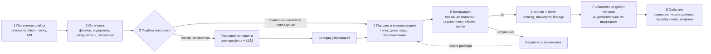

# Data Intake Fabric: слепая загрузка данных

Цель: любой файл или выгрузка, положенные в платформу, обрабатываются без написания нового кода. Платформа сама определяет, что это за данные, к какому контракту они относятся, приводит их к единым типам и кодам, проверяет и делает доступными сервисам. Человек нужен только там, где схема действительно новая или данные не проходят правила.

## 1. Понятия

| Понятие | Что это |
|---|---|
| **Источник** | Откуда приходят файлы: S3‑бакет, SFTP, консоль, API портала, Kafka |
| **Батч** | Один файл или набор частей одного набора (`_part_001_of_162`), обрабатывается как целое |
| **Контракт** | YAML‑описание набора: формат, отпечаток заголовка, колонки с типами и семантикой, ключи, правила качества, партиции, класс приватности |
| **Поток** | Декларация ряда поверх silver: сущность, время, мера, группа сравнения. Потребляется сервисами прогноза и аномалий |
| **Карантин** | Строки или батчи, не прошедшие правила, с причиной и возможностью повторной обработки |
| **Стюард** | Человек, который утверждает новые контракты, сопоставления колонок и кодов, разбирает карантин |

## 2. Путь файла



1. **Появление файла.** Сенсор видит новый объект в landing. Части одного набора собираются в батч по маске имени; батч ждёт, пока придут все части или истечёт таймаут.
2. **Отпечаток.** Определяются формат (CSV, XLSX, JSON, Parquet, ZIP), кодировка (UTF‑8 с BOM, cp1251), разделитель, кавычки, наличие заголовка. Считается сигнатура: нормализованный список колонок и хеш от него.
3. **Подбор контракта.** Точное совпадение сигнатуры → контракт найден. Иначе сопоставление по словарю синонимов колонок и нечёткое сравнение (доля общих колонок ≥ 0,8) → контракт с пометкой «требует подтверждения». Иначе схема новая: автопрофиль (типы, кардинальности, диапазоны дат, кандидаты в ключи, доля пустых) плюс черновик контракта, составленный LLM по профилю и описанию с портала, уходят стюарду. После утверждения файл обрабатывается автоматически, а следующие файлы той же схемы уже не ждут человека.
4. **Парсинг и нормализация.** Парсеры из библиотеки по семантике колонки: даты в нескольких форматах, числа с запятой, коды регионов из названий с разным написанием, названия организаций в коды через MDM, МКБ‑10 к каноническому виду. Обезличивание по классу приватности контракта.
5. **Валидация.** Правила из контракта: схема, диапазоны, ссылочная целостность по справочникам, ожидаемый объём против истории, дубли по ключу и по хешу строки. Уровни: блокировать батч, отправить строки в карантин, предупредить.
6. **bronze и silver.** Bronze хранит оригинал как есть с служебными колонками, silver типизированную и обезличенную версию. Манифест фиксирует источник, размер, контрольную сумму, число строк, версию контракта. Lineage связывает файл, таблицы и витрины.
7. **Gold и потоки.** Витрины и таблицы признаков пересчитываются инкрементально по затронутым партициям. Потоки, описанные поверх этого silver, обновляются автоматически.
8. **События.** В шину уходят события «новый батч набора X», «поток Y обновлён», по которым сервисы пересчитывают прогнозы и аномалии, а ML‑платформа решает, нужно ли переобучение.

## 3. Контракт набора

Пример для направлений ИС БГ. Все значения взяты из фактических файлов.

```yaml
dataset: bg_referrals
title: Направления на плановую госпитализацию в стационары
source:
  system: ИС БГ
  publisher: МЗ РК
  portal_id: magda-ds-4b553445-0570-4302-87e7-48e1edacfa41
format:
  type: csv
  encoding: utf-8-sig
  delimiter: ","
  quote: '"'
  escape: '"'
  parts: "_part_{n:03d}_of_{m:03d}"
grain: одно направление на плановую госпитализацию
keys: [hospitalization_code]
signature:
  - hospitalization_code
  - referring_mo
  - hospital_mo
  - icd10_ref_diag_code
  - diagnosis_name
  - bed_profile
  - registration_dt
  - planned_dt
  - polyclinic_dt
  - hospitalization_dt
  - refusal_dt
  - territorial_type
  - referral_purpose
  - finance_source
  - sdu_load_date
columns:
  hospitalization_code:
    type: string
    semantic: composite_key
    derive:
      region_kato: split(".", 0)
      mo_code: split(".", 1)
      profile_code: split(".", 2)
      seq_no: split(".", 3)
  referring_mo: { type: string, semantic: mo_name, resolve: refdata.mo_registry }
  hospital_mo: { type: string, semantic: mo_name, resolve: refdata.mo_registry }
  icd10_ref_diag_code: { type: string, semantic: icd10, dictionary: refdata.icd10 }
  bed_profile: { type: string, semantic: bed_profile_name, nullable: true }
  registration_dt: { type: timestamp, formats: ["%Y-%m-%d %H:%M:%S.%f", "%Y-%m-%d %H:%M:%S"] }
  planned_dt: { type: timestamp, formats: ["%Y-%m-%d %H:%M:%S"], null_values: ["1970-01-01 00:00:00"] }
  polyclinic_dt: { type: timestamp, nullable: true }
  hospitalization_dt:
    type: timestamp
    nullable: true
    note: время часто проставлено как 08:00, разницы считать в календарных днях
  refusal_dt: { type: timestamp, nullable: true }
  territorial_type: { type: string, enum: [Город, Село] }
  referral_purpose: { type: string, dictionary: refdata.referral_purpose }
  finance_source: { type: string, dictionary: refdata.finance_source }
  sdu_load_date: { type: timestamp, semantic: technical }
privacy:
  class: quasi_identifiers
  direct_identifiers: []
  public_aggregates_min_count: 5
rules:
  - { level: block, check: "registration_dt between '2020-01-01' and now()" }
  - { level: quarantine, check: "hospitalization_dt is null or hospitalization_dt::date >= registration_dt::date" }
  - { level: block, check: "not (hospitalization_dt is not null and refusal_dt is not null)" }
  - { level: warn, check: "rows_per_part between 200000 and 300000" }
  - { level: warn, check: "distinct(region_kato) = 20" }
partition: [region_kato, month(registration_dt)]
streams:
  - name: referrals_daily
    entity: [region_kato, mo_code, profile_code]
    time: { column: registration_dt, grain: day }
    measure: { agg: count }
```

Контракты остальных девяти наборов строятся по той же схеме. Контракт лежит в репозитории, версионируется вместе с кодом и проходит ревью.

## 4. Библиотека парсеров и нормализаторов

| Семантика | Что делает нормализатор | Пример из наших данных |
|---|---|---|
| `timestamp` | Пробует форматы по списку, хранит исходную строку при неудаче | `2025-01-05 08:22:02.517000` и `2025-01-05 00:00:00` в одном файле |
| `region_name` → `region_kato` | Нормализует регистр, латинские буквы, похожие на кириллицу, сокращения, старые названия | `Oбласть Жетісу` с латинской «O», `Область ?лытау` с битым символом, `Алматы г.а.` |
| `mo_name` → `mo_code` | Убирает кавычки, организационно‑правовую форму, двойные пробелы; сопоставляет с реестром МО нечётко; спорные случаи стюарду | 1 406 организаций в направлениях, 449 в отказах приёмного покоя, ставки только с названиями |
| `icd10` | Приводит к виду `A00.0`, извлекает главу и блок как признаки | `J03.9`, `M54.4` |
| `composite_key` | Разбирает составные коды по шаблону | `10.00MY.072.1` → регион `10`, МО `00MY`, профиль `072`, номер `1` |
| `money`, `count` | Десятичная запятая, пробелы в тысячах, отрицательные значения в карантин | `38857850.453125` |
| `parts` | Собирает части в батч, проверяет, что пришли все | `_part_001_of_162` … `_part_162_of_162` |
| `dialect` | Явные кавычки вместо автоопределения | Отказы от вакцинации: автоопределение теряло 16 тыс. строк |

## 5. Правила качества и карантин

- **Схема:** обязательные колонки, типы, допустимые значения.
- **Диапазоны:** даты в разумных пределах, суммы и счётчики неотрицательные.
- **Справочники:** коды регионов, МО, профилей, МКБ‑10 существуют в MDM; неизвестные коды в карантин с предложением добавить в справочник.
- **Объём:** число строк батча против истории того же набора; резкое отклонение это предупреждение стюарду, а не блокировка.
- **Дубли:** по ключу внутри батча и против уже загруженного; повторная загрузка того же файла идемпотентна по контрольной сумме.
- **Карантин** хранит строку, причину, версию контракта и позволяет переработать после исправления правила или справочника.

## 6. Что видит стюард

Консоль загрузки данных: очередь новых файлов и их статус, распознанные наборы, батчи в ожидании частей, черновики контрактов на утверждение с автопрофилем и предложенным сопоставлением колонок, карантин с группировкой по причинам, история загрузок с манифестом и lineage. Действия: утвердить, сопоставить вручную, переработать, отклонить.

## 7. Интерфейсы

- **CLI:** `intake add <path|url>`, `intake status`, `intake contracts`, `intake reprocess <batch>`.
- **API:** `POST /intake/files`, `GET /intake/batches/{id}`, `GET /intake/contracts`, `POST /intake/contracts/{id}/approve`.
- **События:** `intake.batch.loaded`, `intake.batch.quarantined`, `intake.contract.pending`, `stream.updated`.

## 8. Как это выглядит на кэмпе

- Сенсор на папку `landing/` в Docker Compose, Iceberg через pyiceberg, DuckDB как движок.
- Контракты для десяти наборов, которые уже есть, плюс словарь синонимов колонок.
- Демонстрация: кладём в `landing/` новую часть направлений и новый файл неизвестной схемы. Первая проходит до gold и обновляет прогнозы без участия человека; вторая появляется у стюарда с черновиком контракта, стюард утверждает, файл доходит до gold.
- Метрики домена: доля автоматически распознанных файлов, время до gold.
