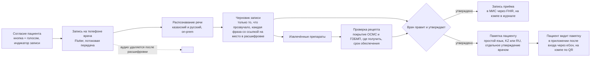

# Консультация: AI‑скрайб, рецепт и памятка пациенту

Две функции для режима врача в Darumen Care, которые складываются в один сценарий приёма: врач включает микрофон, система расшифровывает разговор и собирает черновик записи, врач правит и утверждает, из утверждённой записи рождается памятка пациенту; названные на приёме препараты сразу проверяются на покрытие ОСМС и доступность в аптеках региона.

## 1. Сценарий приёма

Роль AI здесь строго секретарская: система записывает то, что сказал врач, и находит справочную информацию о лекарствах. Диагноз, назначения и формулировки принадлежат врачу; ничего не показывается пациенту без утверждения врача. Это и есть human‑in‑the‑loop в чистом виде, а не приписка на слайде.

## 2. AI‑скрайб

### Что делает
| Шаг | Что происходит | Где границы |
|---|---|---|
| Согласие | Пациент соглашается на запись кнопкой на экране врача и голосом; согласие сохраняется вместе с записью | Без согласия микрофон не включается |
| Распознавание | Потоковая расшифровка на казахском и русском со смешением языков, медицинский словарь для терминов и названий препаратов | Модель речи работает внутри периметра, аудио в облако не уходит |
| Черновик записи | Структурированная запись приёма: жалобы, анамнез со слов пациента, осмотр, оценка врача, план, назначения, следующий визит. Каждая фраза черновика ссылается на фрагмент расшифровки | Система не добавляет ничего, чего не было сказано; пустые разделы остаются пустыми |
| Утверждение | Врач видит черновик рядом с расшифровкой, правит, утверждает. Правки сохраняются как сигнал качества | Без утверждения запись никуда не уходит |
| Памятка пациенту | Из утверждённой записи собирается версия для пациента простым языком на выбранном языке: что обсудили, что назначено, куда и когда идти, когда обратиться срочно | Памятка утверждается врачом отдельно; никаких новых рекомендаций сверх записи |
| Хранение | Запись приёма уходит в МИС (FHIR DocumentReference), памятка доступна пациенту в приложении; аудио удаляется сразу после расшифровки | Darumen не хранит медицинскую карту |

### Модели и метрики
- **Распознавание речи.** Whisper large‑v3 поддерживает казахский и русский; для казахской медицинской речи используем открытый корпус ISSAI (Назарбаев Университет) и дообучение как расширение. Метрика: WER на собственном тестовом наборе приёмов на двух языках, отдельно по медицинским терминам и названиям препаратов.
- **Сборка записи.** LLM с жёстким ограничением «только из расшифровки» и обязательными ссылками на фрагменты. Метрики: доля утверждений записи, подтверждённых фрагментом расшифровки (faithfulness), доля черновиков, принятых врачом без правок, число правок на запись, время документирования до и после.
- **Памятка.** Метрики: читаемость, доля памяток, утверждённых без правок, понятность по опросу пациентов на пилоте.

### Приватность и право
- Голос это биометрические данные, содержание приёма это врачебная тайна. Нужны: явное согласие пациента, обработка внутри периметра МИС или ЦОД НИТ, удаление аудио после расшифровки, шифрование расшифровок, журнал доступа.
- На кэмпе только синтетические приёмы: сценарии читают члены команды, реальных пациентов и реальных записей нет. Это честно указывается в демо.
- Вопрос организаторам: требования к согласию и хранению аудио для пилота, допустимость облачной LLM для черновиков (в продакшене только on‑prem или по договору обработки).

### Данные для кэмпа
- 20–30 сценариев приёма на русском и казахском, записанных командой, с эталонными расшифровками и эталонными записями для метрик.
- Медицинский словарь терминов и МНН из справочника препаратов.

## 3. Проверка рецепта: покрытие ОСМС и где получить

### Что видит врач и пациент
| Вопрос | Ответ системы | Источник |
|---|---|---|
| Покрывается ли препарат бесплатно при этой нозологии? | Да или нет по перечню амбулаторного лекарственного обеспечения (ГОБМП и ОСМС), с указанием программы и категории | Нормативный перечень АЛО (открытый НПА), справочник спецификаций препаратов: `nosology_id, category_id, program_id, spec_unit_price` |
| Где его реально получают в моём регионе? | Аптеки региона, где по этому МНН обеспечивались рецепты за последние недели, доля обеспечения | Обеспеченные рецепты: `drug_store_id, drug_mnn_id, recipe_date, recipe_prov_date` |
| Сколько ждать обеспечения? | p50 и p90 срока от выписки до обеспечения по региону и МНН, вероятность обеспечения за 7 и 14 дней | Модель на паре «выписано → обеспечено» |
| Есть ли дефицит? | Сигнал, если разрыв между выписанными и обеспеченными рецептами по региону и МНН вырос против похожих регионов | Anomaly & Alerting на потоке рецептов |
| Что делать, если нет? | Другая спецификация того же МНН по перечню, соседний район, эскалация в управление здравоохранения | Справочник спецификаций, реестр аптек |

Врач выбирает препарат сам. Система не предлагает, что назначить, не проверяет взаимодействия и дозы: это клиническая поддержка принятия решений, то есть медицинское изделие, и это вне рамок программы. Система отвечает только «покрыто ли, где взять, сколько ждать».

### Модели и метрики
- **Срок обеспечения** (Medicines Intelligence): та же конструкция, что и ожидание госпитализации. Цель: дни от `recipe_date` до `recipe_prov_date`, конкурирующий исход «не обеспечен». Признаки: регион, МНН, категория, нозология, аптека, текущая доля обеспечения по региону и МНН, сезон. Метрики: пинбол‑лосс p50 и p90, калибровка P(обеспечен за 14 дней), AUC для необеспечения; baseline «медиана по региону и МНН за прошлый месяц».
- **Дефицит:** robust z по разрыву «выписано минус обеспечено» относительно похожих регионов; precision@k на исторических эпизодах дефицита.
- **Прогноз спроса** по региону и МНН на 1–3 месяца для закупок единого дистрибьютора: sMAPE против сезонного наива.

### Данные
- Есть: выписанные рецепты с 2018 года (153 части, 24,6 ГБ), обеспеченные рецепты (143 части, 32 ГБ), справочник спецификаций препаратов (2,6 ГБ).
- Нужно запросить: справочники к рецептам, пункт 12 в [data-requests.md](data-requests.md): МНН, аптеки с регионом и адресом, поликлиники, нозологии, категории, программы. Без справочника аптек «где получить» не показать.
- Берём сами: перечень АЛО из открытых НПА, реестр аптек с лицензиями из открытых данных, если организаторы не дадут справочник.

## 4. Где это живёт в продукте

| Линейка | Что добавляется |
|---|---|
| **Darumen Care**, режим врача | Кнопка записи приёма, черновик записи, утверждение, проверка рецепта, отправка памятки |
| **Darumen AI** | Модель речи, сборка записи и памятки, объяснения; всё через утверждение врача |
| **Darumen Med** | Medicines Intelligence: покрытие, аптеки, срок обеспечения, дефицит, прогноз спроса |
| **Darumen** (гражданин) | Мои памятки и мои рецепты: что назначено, покрыто ли, где получить, когда прийти |

## 5. Место в плане

| Этап | Скрайб | Рецепт |
|---|---|---|
| Кэмп | Демо на синтетическом приёме: запись, черновик, утверждение, памятка по QR; метрики WER и faithfulness на своём наборе | Покрытие по перечню АЛО, срок обеспечения и дефицит по регионам и МНН на реальных рецептах; аптеки, если дадут справочник |
| Пилот | Реальные приёмы с согласием, on‑prem распознавание, запись в МИС | Реестр аптек, памятка пациенту с картой |
| Национальный масштаб | Дообученная модель казахской медицинской речи, встраивание в МИС | Прогноз спроса для закупок, сигналы дефицита для МЗ |

Честная оценка приоритета: проверка рецепта ложится на данные, которые уже есть, и усиливает линейку Med, её стоит делать в основной очереди. Скрайб это самая эффектная демонстрация human‑in‑the‑loop на защите, но он не про нагрузку на стационары и тяжёл по приватности; делаем его после ядра Кейса 1, на синтетических приёмах, и показываем как часть Darumen AI.
